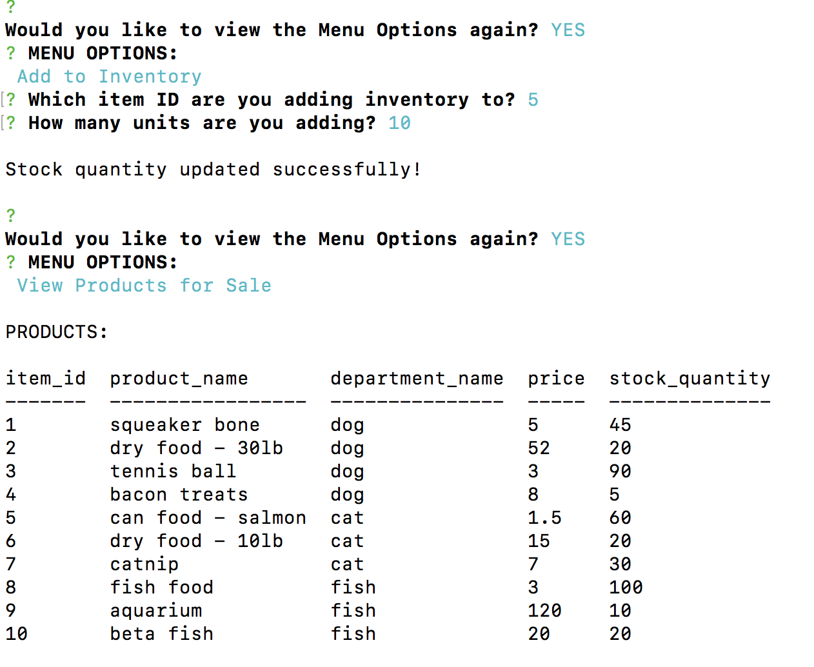

# BAMAZON - The Place for Pets!

## Project Overview

This application involves an Amazon-like storefront that uses MySQL to store product information and inventory. The CLI app takes orders from customers and depletes stock, and also allows managers to view products, view low inventory, add inventory, and add new products.

## Installation

```
git clone https://github.com/brittani1128/bamazon.git  

cd bamazon  

npm install  

```

## How to Run

### AS A CUSTOMER:

``` 
node bamazonCustomer.js 
```

Follow the prompts to select which product ID you would like to purchase and quanity


Select YES to make another purchase.  
If attempting to purchase more than stock quantity, customer will receive an 'Insufficient Quantity' error.


Select NO to finish purchase


### AS A MANAGER:

``` 
node bamazonManager.js 
```
Select desired menu option


View current products available


View products with low inventory


Add inventory to a product




Add a new product


